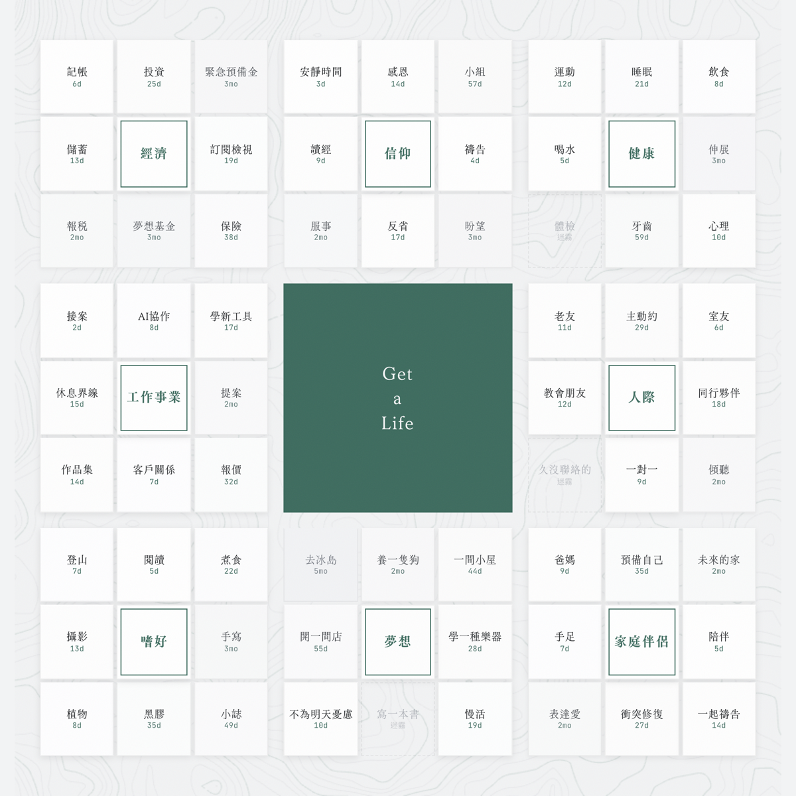
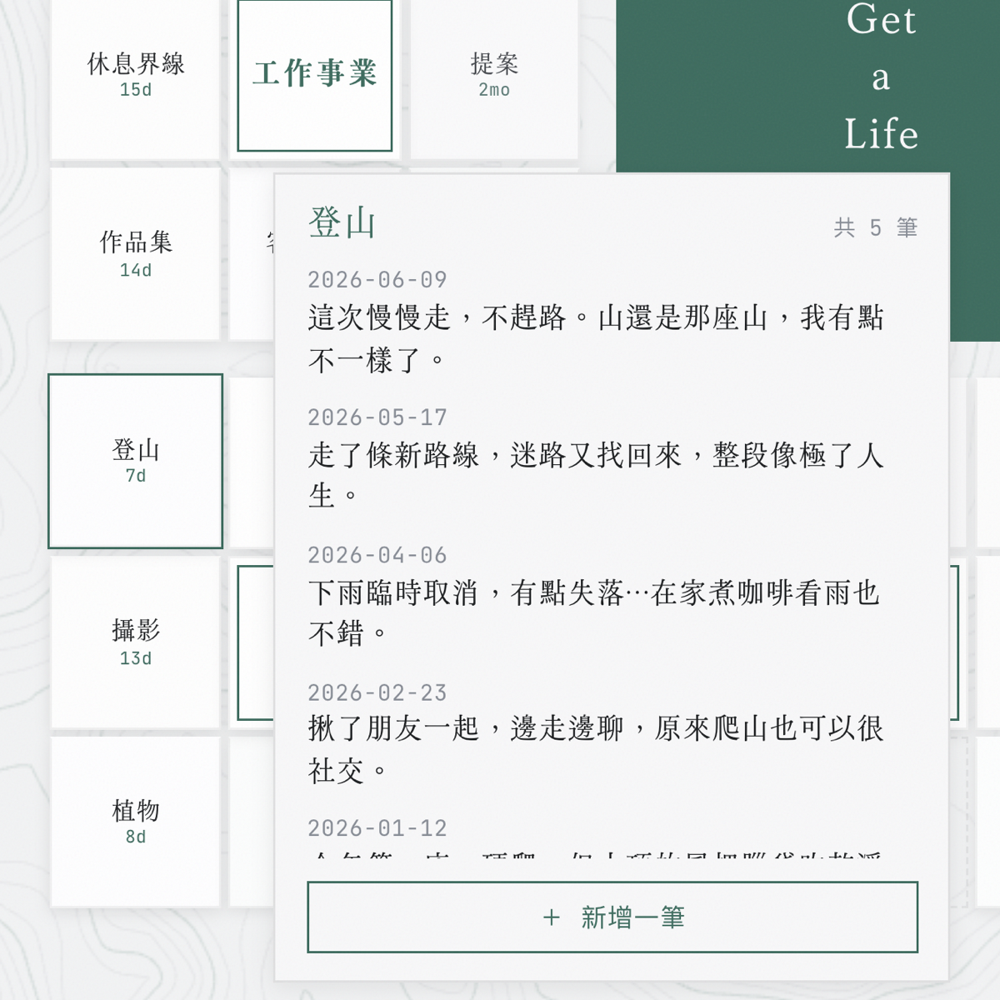
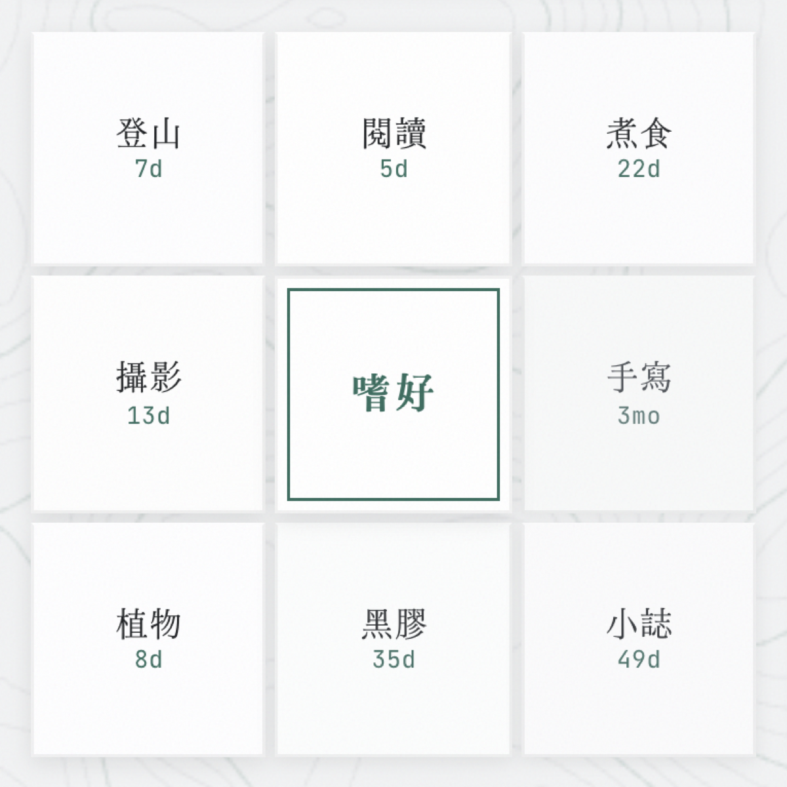
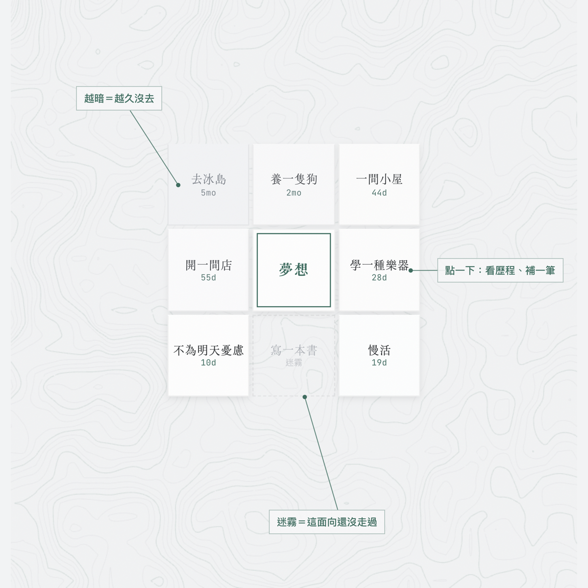

# Get a Life

一個幫自己盤點人生的小工具：資料是純 Markdown，搭配一個本機 viewer，把生活分成八個領域畫成一張九宮格，讓你看得到自己最近把心力放在哪、哪些地方很久沒碰。



## 機制：八個領域 × 八個方向

這套機制受曼陀羅計畫（大谷翔平用過的那種九宮格目標法）啟發，做法分三步：

1. **先想出人生的 8 個領域**。例如健康、嗜好、工作、人際……換成對你成立的八塊。
2. **針對每個領域，各想出 8 個可以關注或努力的方向**。例如「嗜好」這塊，底下可能是爬山、閱讀、攝影。八個領域、每個八個方向，合起來排成 9×9 的格狀圖（中央格留給標題）。
3. **開始記錄**：生活中什麼時候、在哪個方向做了什麼，就到那一格寫一行。

這樣持續記錄下去，你就能看見自己這段時間對人生各個方向的努力分布在哪裡。每個格子的亮度由「最近一次記錄的日期」決定：最近有記錄就亮，越久沒記錄就越暗，從沒記錄過的顯示為虛線「迷霧」。久未經營的方向會自己浮現出來。

操作只有兩種：

- **左鍵點一格**：寫一行記錄，存回對應的 `.md`，該格的日期更新、重新變亮。
- **右鍵點一格**：設一個「下一步」，也就是你想清楚、但還沒開始做的那件事。一格一個，不影響亮度；總覽截圖裡看不到，要右鍵才會出現。

資料全部是純文字，不依賴這個工具也能讀寫。

| 記一筆 | 看一格 | 視覺語言 |
|---|---|---|
|  |  |  |

## 目前做了什麼、還沒做什麼

已經能用：

- **全貌**：八個領域並排，每格依最近記錄日期顯示亮暗。
- **左鍵記一筆**，寫回 `.md`。
- **右鍵設「下一步」**。

還在規劃（目前可用手動編輯 `.md` 達成）：

- **時間軸 pivot**：單一領域的長期趨勢。
- **新增 / 封存方向的介面**：現在靠直接改 `.md`。

## 這不是什麼

- **不是要部署的網站**，是本機工具。寫回記錄需要 dev server，靜態托管無法記錄（見下方 local-first 說明）。
- **不是即插即用的產品**，是一份參考實作。frontmatter 欄位是中文，八個領域是範例，使用前要自己調整。
- 它幫你看見現況與變化，不會替你判斷哪塊比較重要。

設計上的取捨見 [DESIGN-NOTES.md](DESIGN-NOTES.md)，完整資料模型見 [MECHANISM.md](MECHANISM.md)。

## 跑起來

```bash
cd viewer
npm install
npm run dev          # http://localhost:4321
```

第一次執行會讀取隨附的範例資料 `demo-mandala/`，不需任何設定就能看到完整畫面。Docker 用法見 [viewer/README.md](viewer/README.md)。

## 用你自己的資料

資料目錄由 `MANDALA_DIR` 決定，解析順序為：環境變數 → `mandala/` → `demo-mandala/`。

```bash
cp -r demo-mandala mandala     # mandala/ 已列入 gitignore，不會進 repo
# 編輯 mandala/*.md 換成你自己的八塊領域，重啟 dev server 生效
```

`demo-mandala/` 的八塊只是範例，可以整批換掉。也可以不複製，直接指定路徑：`MANDALA_DIR=/path/to/yours npm run dev`。

## 資料格式

每個領域一個檔案（`N-名稱.md`）。frontmatter 記錄這塊地有哪些方向與各自的日期，body 是每個方向底下的記錄。

```markdown
---
大格: 嗜好
position: 7
last_tended: 2026-06-09
小格:
  - 詞: 爬山
    born: 2026-01-01
    last_tended: 2026-06-09
    archived: false
---

## 爬山
- 2026-06-09 — 走了之前沒走過的路線，慢慢走、不趕路。
```

一塊地的荒廢程度由「多久沒有新記錄」推算。沒有更動方向的名稱屬於正常狀態，不代表荒廢；判斷依據只有記錄的新舊。沒有記錄的方向顯示為迷霧，這是中性的現況，不是待辦事項。完整規則見 [MECHANISM.md](MECHANISM.md)。

## local-first 設計

寫回 `.md` 依賴 dev server 的 on-demand API route，所以必須用 `npm run dev`（或 Docker）在本機執行，純靜態 build 無法寫回。這樣設計的結果是：你的資料一直留在自己的機器上，工具只是讀寫這些檔案的一層介面。

## 打造方式

這個專案是用 AI coding agent（Claude Code）協助開發的，git 歷史裡的 commit 都標了 Claude 為共同作者。

## 字型（選用，自備）

介面的襯線字會優先用自訂明體，找不到就退回系統襯線字。repo 不附任何字型檔，因為多數中文明體是付費商用字型，不適合連同公開 repo 一起散布。不放字型也能正常執行，會退回 `Songti TC`、`Noto Serif CJK`、`Georgia` 等系統字。想用自己偏好的明體，把你有授權的 `.otf` 放進 [viewer/public/fonts/](viewer/public/fonts/)，檔名見該資料夾說明。

## License

[MIT](LICENSE)。程式碼與設計筆記可自由取用，範例資料為虛構。字型需自備（見上）。
